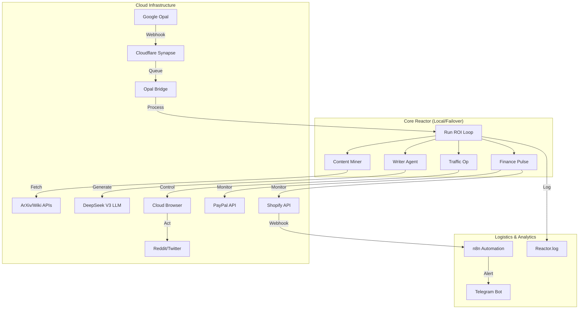

# YEDAN V2.0 System Architecture

## 🧠 Cognitive Engine Overview

YEDAN V2.0 is a cloud-native Autonomous General Intelligence (AGI) designed for fully automated e-commerce operations. It operates on a continuous infinite loop, orchestrating content mining, product creation, social engagement, and financial optimization.



## 🔄 The Infinite Business Cycle

The system executes a strictly defined business cycle (`run_roi_loop.py`) designed for resilience and profit maximization.

1.  **Mining Operation**:
    *   Scans **ArXiv, Wikipedia, and Google Trends** for emerging high-value topics.
    *   Prioritizes content from **Google Opal** (via `OpalBridge`) if available.

2.  **Factory Operation (Writer)**:
    *   Synthesizes raw data into "Golden Content" using **DeepSeek V3**.
    *   Generates **Shopify Products** (Digital Assets) or **Blog Articles**.

3.  **Traffic Operation**:
    *   **CloudSocial Agent** wakes up.
    *   Connects to **Browserless.io** (Headless Chrome in Cloud).
    *   Executes **Real** engagement on Reddit/Twitter (subject to `SAFETY_MODE`).

4.  **Logistics**:
    *   Checks **n8n** workflows for order processing status.
    *   Syncs inventory and customer data.

5.  **Finance Pulse**:
    *   Pings **PayPal** and **Shopify** for real-time ROI metrics.
    *   Reports daily revenue to **Synapse** (Cloudflare Worker).

## 🛡️ Security & Reliability

*   **Centralized Config**: All secrets managed via `modules.config.Config`.
*   **Watchdog**: A separate agent (`watchdog.py`) monitors the Core Reactor's heartbeat.
*   **Failover**: `start_v2.bat` ensures the system auto-restarts upon crash (5s linear backoff).

## 📂 File Structure

```text
YEDAN-AGI/
├── modules/
│   ├── config.py           # Central Intelligence
│   ├── cloud_social.py     # Browserless Controller
│   ├── opal_bridge.py      # Synapse Connector
│   └── watchdog.py         # Health Monitor
├── logs/
│   └── reactor.log         # Black Box Recorder
├── run_roi_loop.py         # Main Engine
└── start_v2.bat            # Failover Launcher
```
